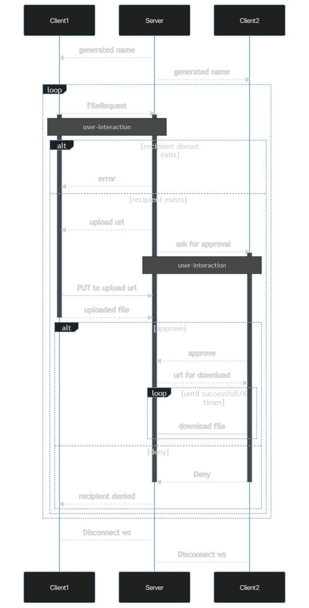

<h1 align="center">
    
</h1>
 

Screenshots

 

|                                  Desktop                                |                                 Mobile PWA                                  |
| :-------------------------------------------------------------------------: | :-------------------------------------------------------------------------: |
|  |  |

### Built With

 - [Kotlin MP](https://kotlinlang.org/docs/multiplatform.html)
 - [KTor](https://github.com/ktorio/ktor)
 - [Faker](https://github.com/serpro69/kotlin-faker)

 - [WebSockets](https://developer.mozilla.org/en-US/docs/Web/API/WebSockets_API)

## Getting Started

### Prerequisites

 - Java 8+

## Usage

### Server

Execute `build/install/filetap/bin/filetap` or `build/install/filetap/bin/filetap.bat`, depending on your system, to start the server.

### User

When you access the site, `http://localhost:8000` by default, you will get a random name after connecting to the server.
This name consists of a random color and animal. This your temporary name.

To send a package, the sender needs to input the temporary name of the recipient in the `Recipient` field.
After selecting a file, by clicking the box, the sender can click `Send` to send the package and information to the server.

The Server will then hold the package and asked the recipient to accept the package. Once accepted, the recipient will be downloading the delivered package.

## Diagram

This is the *approximate* Sequence Diagram, to model the information flow.

## License

This project is licensed under the **GNU General Public License v3**.

See [LICENSE](LICENSE) for more information.
